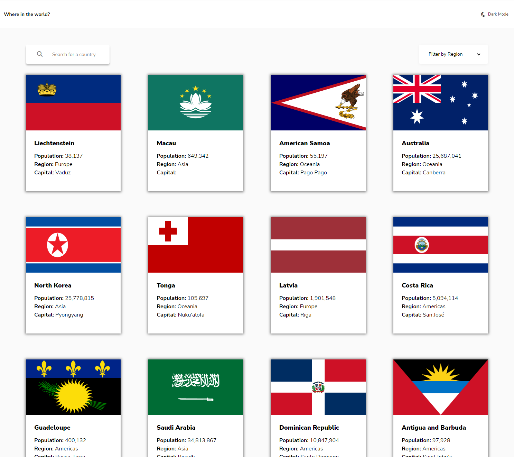
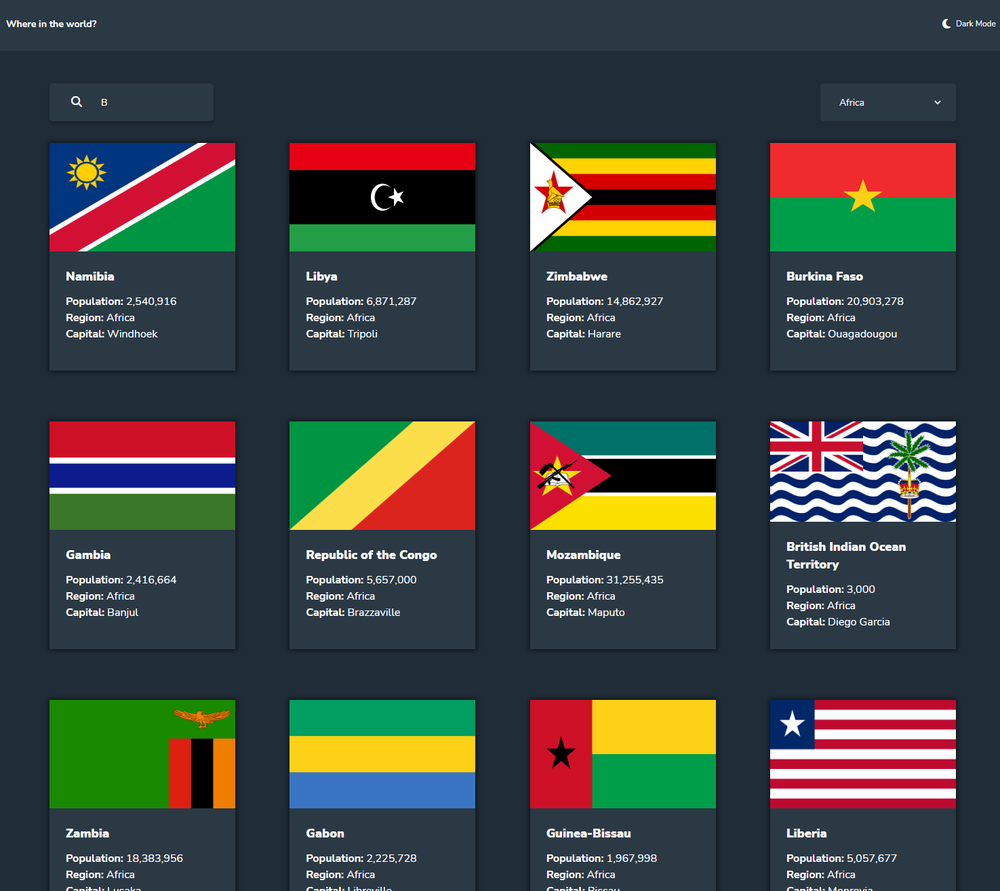

# Getting Started with Create React App

## Quick View

### Light Mode

### Dark Mode

### Live link
https://rest-countries-mchan.netlify.app/

## Setup

In the project directory, you should run:

### `npm install`

First install the npm packages

### `npm start`

This will open the page at localhost:3000

### Description
A small challenge from [Frontend Mentor](https://www.frontendmentor.io/challenges/rest-countries-api-with-color-theme-switcher-5cacc469fec04111f7b848ca). I mainly wanted to do this one to get some experience using a light and dark theme. The API was fairly easy to use and it wasn't too difficult to convert the data to a readable format. I didn't spent too much time on this to make it pixel perfect and it only looks good on 375px width due to the Figma design. I'd probably add tests for the API results and also add more responsive breakpoints so it looks good on most mobile screens.
